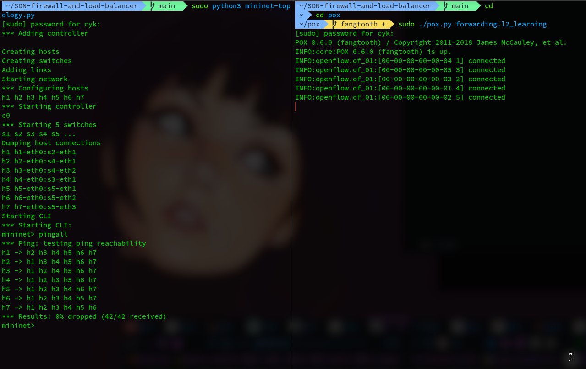
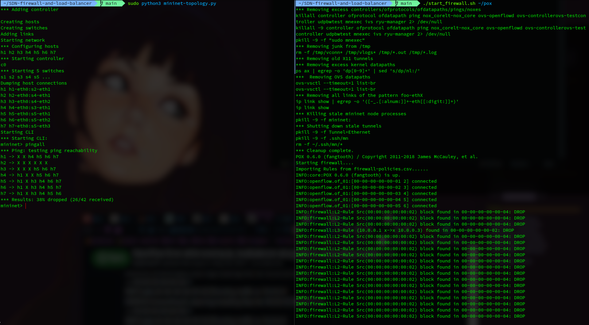
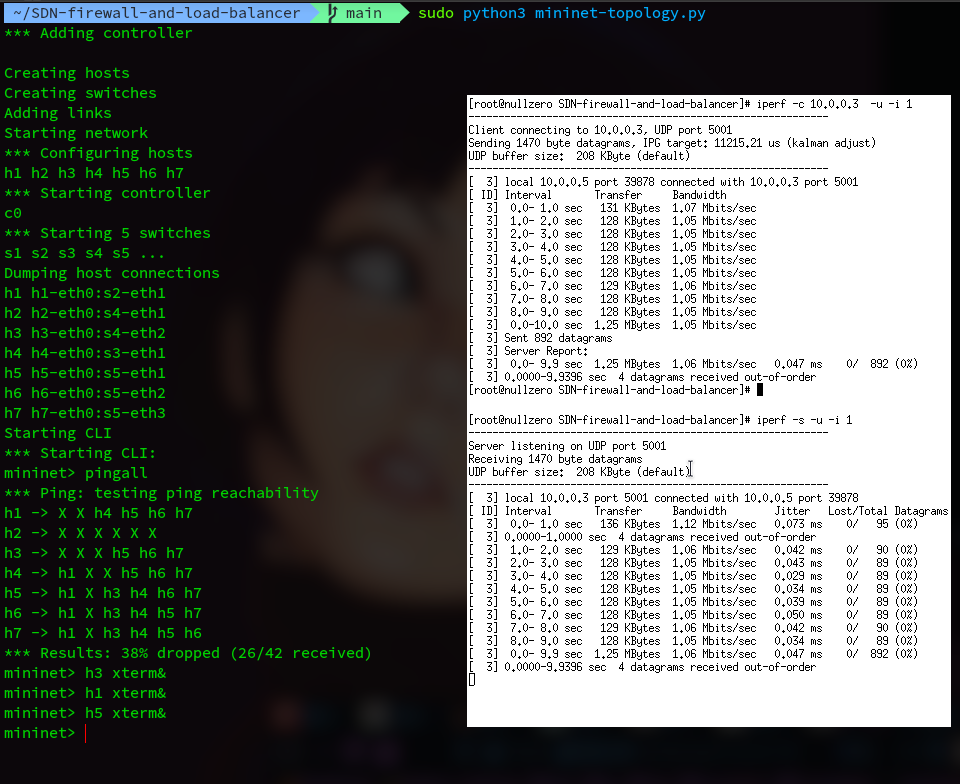
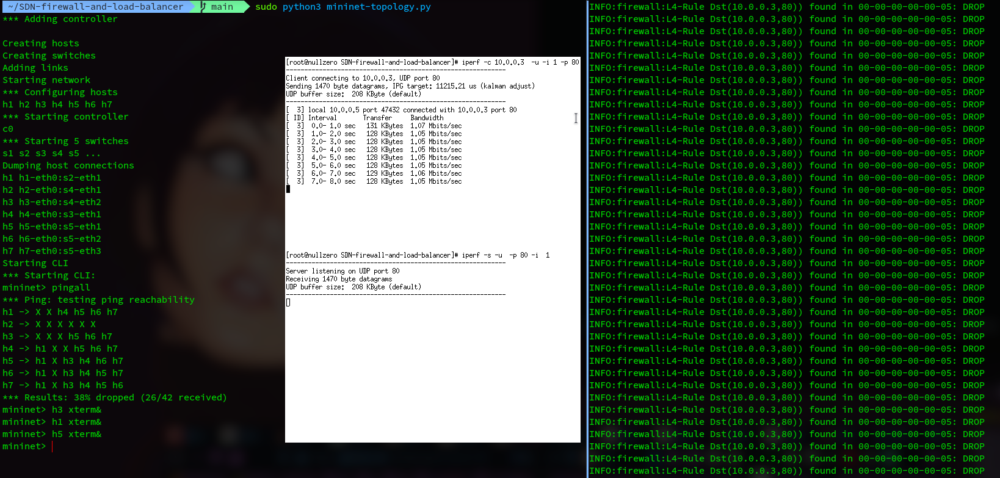
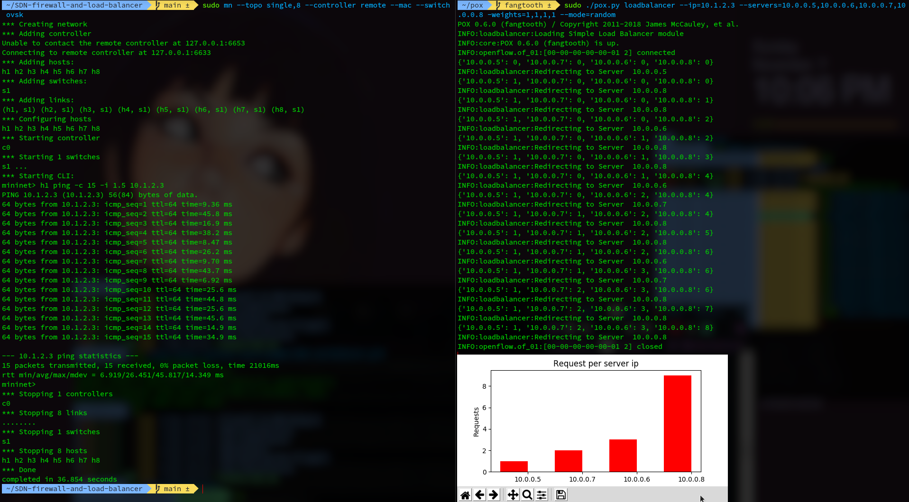
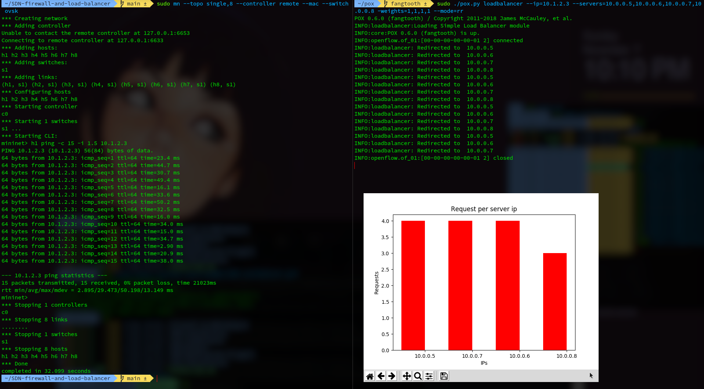
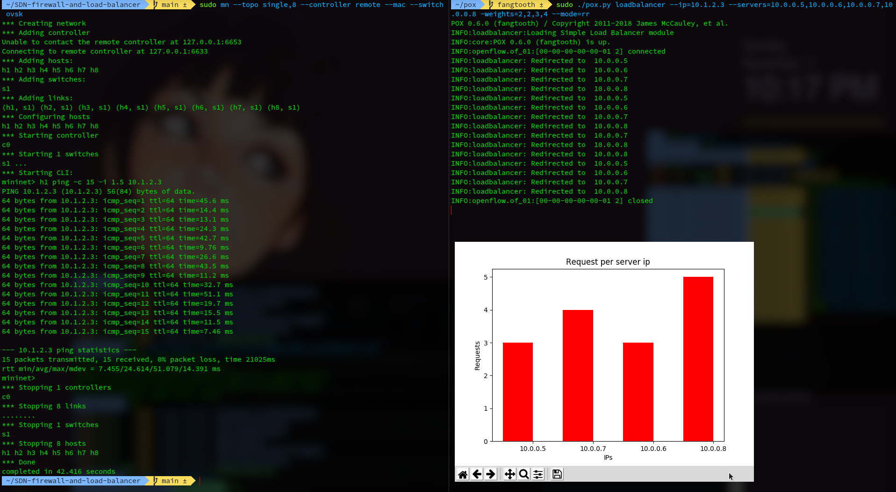

# SDN Firewall and Load Balancer
Implementation of firewall and load balancer on SDN network

### Software requirements

* Mininet
* pox
* sudo python2  -m pip -r requirements.txt
* sudo apt-get install tk

Default Firewall rules: 

* Rule1: Block all outgoing packets from mac address 00:00:00:00:00:02 
* Rule2: Block all packets from 10.0.0.3 to 10.0.0.4 
* Rule3: Block all packets from 10.0.0.1 to 10.0.0.3

* Rule4: Block incoming packets to 10.0.0.3 port 80


To start firewall , run

```bash
./start_firewall.sh <pox-directory>
```

after that, start mininet 

```
sudo python3 mininet-topology.py
```

to test rules, run the following:

```
mininet> pingall
```

to check that packets from h3 reach h1 run:

(since we are using udp, we need not confirm by reply)

```
h1 xterm> iperf -s -u -i 1
```

```
h3 xterm> iperf -c 10.0.0.1 -i 1
```

to check that packets from h1 dont get to h3 run:

```
h3 xterm> iperf -s -u -i 1
```

```
h1 xterm> iperf -c 10.0.0.3 -i 1
```


to check that port 80 of h3 is blocked

```
h3 xterm> iperf -s -u -i 1 -p 5001
```

```
h5 xterm> iperf -c 10.0.0.3 -i 1 -p 5001
```


we can see packets reaching h3 via 5001
but whereas in port 80, it gets blocked

```
h3 xterm> iperf -s -u -i 1 -p 80
```

```
h5 xterm> iperf -c 10.0.0.3 -i 1 -p 80
```


### Load Balancer

first copy the loadbalancer into  the pox directory

```bash
cp loadbalancer.py <pox-dir>
```

then start the loadbalancer controller by

```bash
sudo ./pox.py loadbalancer --ip=10.1.2.3 --servers=10.0.0.5,10.0.0.6,10.0.0.7,10.0.0.
8 --weights=2,2,3,4 --mode=random
```

or

```bash
sudo ./pox.py loadbalancer --ip=10.1.2.3 --servers=10.0.0.5,10.0.0.6,10.0.0.7,10.0.0.
8 --weights=2,2,3,4 --mode=rr
```

Here the weights denote the server handling capacity.

in mode `random`, the packet is send to a random server .

in mode `rr` , the packets are distributed by weighted round robin fashion.  

start a single cluster mininet with 8 nodes : 

```bash
sudo mn --topo single,8 --controller remote --mac --switch ovsk
```

we can see the load balancing process by pinging the server:

```
mininet> h1 ping -c 15 10.1.2.3
```

after that when we exit the mininet , we get a graph of the packet distribution among the servers.

### RESULTS


Starting mininet and pox l2_learning with no firewall, testing with pingall 



Starting mininet and pox with firewall, testing with pingall (showing L2 and L3 rules)



Testing L4 rule by sending udp packets over ports 80 and 5001





---


Running loadbalancer with `random` mode



Running loadbalancer with `round robin` mode (weighted round robin with equal weights)


Running loadbalancer with `weighted round robin` mode


